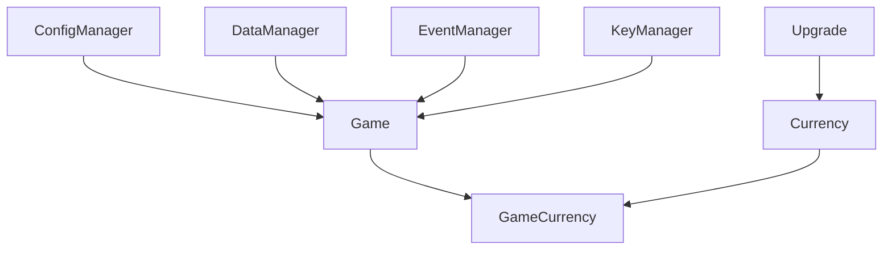
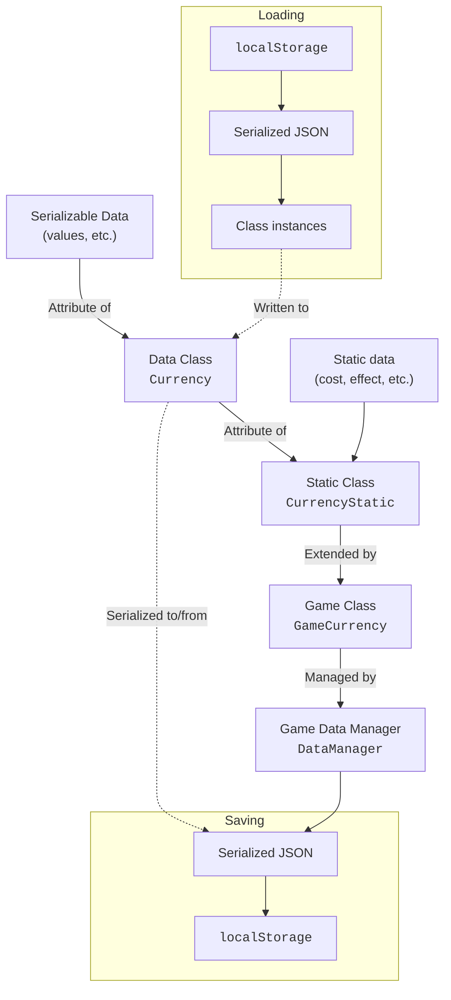

# emath.js/src

This is the source code for the emath.js library. It is written in TypeScript and compiled to JavaScript.

If you want to contribute to the library, please read the [CONTRIBUTING.md](../CONTRIBUTING.md) file.

## Structure

- [`/index.ts`](./index.ts): The entry point for the library. This file exports the main classes and functions.
- [`/hookMain.ts`](./hookMain.ts): The entry point for CDN usage. This file declares the `eMath` object and sets it to the `window` object.

- [`/common/`](./common): Contains common code used in the library. Currently only contains common types.
- [`/classes/`](./classes): Contains the classes used in the library, exported by `emath.js`. Each class is in its own file.
- [`/E/`](./E): Contains code for the `Decimal` class. The code is ported from `break_eternity.js` and compiled from source.

- [`/game/`](./game): Contains the code that is exported by `emath.js/game`. This includes the `Game` class and other classes that are used in the game.
  - [`/index.ts`](./game/index.ts): The entry point for the game code. This file exports the `Game` class and other classes.
  - [`/hookGame.ts`](./game/hookGame.ts): The entry point for

- [`/presets/`](./presets): Contains the code that is exported by `emath.js/presets`. This includes the `eMathPresets` object and other presets.

## Diagram

Class Serialization

